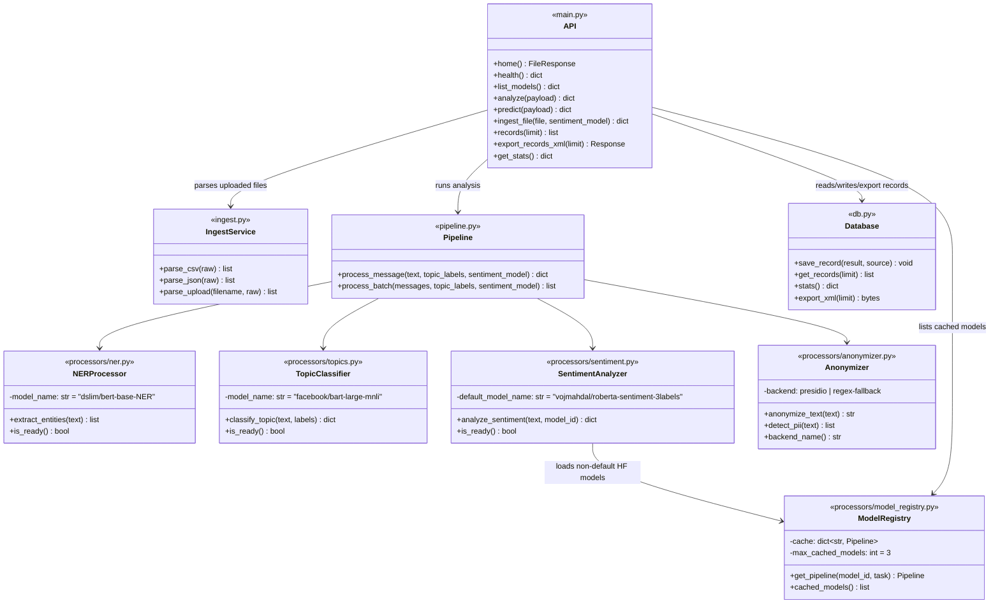

# Class diagram - V3

Modules are shown as facade classes over their public functions. GitHub
renders this Mermaid diagram directly. Compared to V2, this adds
`ModelRegistry` (dynamic Hugging Face model loading/caching for sentiment
analysis) and `export_xml()` on `Database`.

