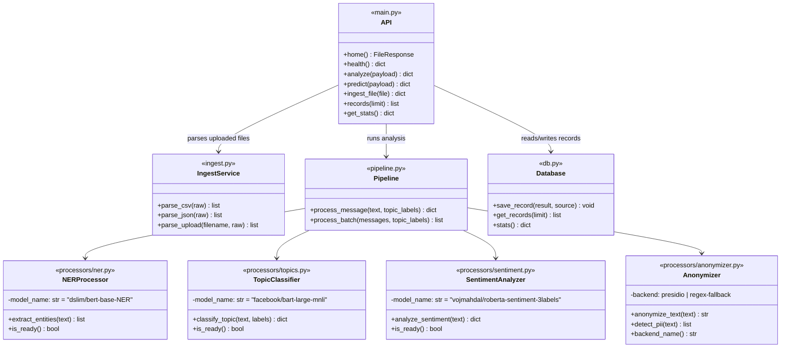

# Class diagram - V2

Modules are shown as facade classes over their public functions. GitHub
renders this Mermaid diagram directly.

```mermaid
classDiagram
    class API {
        <<main.py>>
        +home() FileResponse
        +health() dict
        +analyze(payload) dict
        +predict(payload) dict
        +ingest_file(file) dict
        +records(limit) list
        +get_stats() dict
    }

    class IngestService {
        <<ingest.py>>
        +parse_csv(raw) list
        +parse_json(raw) list
        +parse_upload(filename, raw) list
    }

    class Pipeline {
        <<pipeline.py>>
        +process_message(text, topic_labels) dict
        +process_batch(messages, topic_labels) list
    }

    class NERProcessor {
        <<processors/ner.py>>
        -model_name: str = "dslim/bert-base-NER"
        +extract_entities(text) list
        +is_ready() bool
    }

    class TopicClassifier {
        <<processors/topics.py>>
        -model_name: str = "facebook/bart-large-mnli"
        +classify_topic(text, labels) dict
        +is_ready() bool
    }

    class SentimentAnalyzer {
        <<processors/sentiment.py>>
        -model_name: str = "vojmahdal/roberta-sentiment-3labels"
        +analyze_sentiment(text) dict
        +is_ready() bool
    }

    class Anonymizer {
        <<processors/anonymizer.py>>
        -backend: presidio | regex-fallback
        +anonymize_text(text) str
        +detect_pii(text) list
        +backend_name() str
    }

    class Database {
        <<db.py>>
        +save_record(result, source) void
        +get_records(limit) list
        +stats() dict
    }

    API --> IngestService : parses uploaded files
    API --> Pipeline : runs analysis
    API --> Database : reads/writes records
    Pipeline --> NERProcessor
    Pipeline --> TopicClassifier
    Pipeline --> SentimentAnalyzer
    Pipeline --> Anonymizer
```
